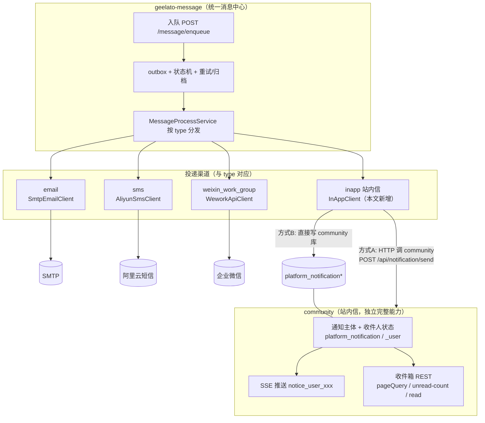

# 消息投递集成指南

本文讲清两件事：

1. **geelato-message（统一消息中心）** 如何投递消息——包括如何新增一个投递渠道（以「站内信渠道」为例）。
2. **community 平台站内信** 作为一个独立、完整的能力，如何被投递、如何被消费。

> **核心架构认知**：geelato-message 是统一消息中心，负责所有消息（邮件 / 短信 / 企业微信 / 站内信）的**投递编排与可靠性**（outbox、状态机、重试、归档）。**站内信与邮件平级，只是 geelato-message 的一个投递渠道**。community 的站内信能力完全独立、自包含（自己的主体表、收件箱、SSE、查询），与 geelato-message 无强耦合。

## 架构总览



**方向要点**：geelato-message → community（geelato-message 投递站内信时调用 community 落地）。不是反过来。

**两边各自存储，最终一致、各司其职**：
- geelato-message 的 `platform_msg`：投递记录，服务于可靠性、审计、运维。
- community 的 `platform_notification`：业务呈现，服务于收件箱、已读、跳转。

---

# 第一部分：geelato-message 如何投递消息

## 1.1 投递一条消息（调用方视角）

向 geelato-message 投递消息，统一走入队接口：

```
POST {geelato-message}/message/enqueue      # 默认端口 8086
Content-Type: application/json

{
  "title": "合同待审批",
  "content": "合同 HT-001 请尽快审批",
  "type": "inapp",                                  ← 决定走哪个渠道
  "sender": "system",
  "receiver": "{\"type\":\"userId\",\"list\":[\"u1\",\"u2\"]}",
  "bizKey": "contract:HT-001",
  "buss": "contract",
  "sourceSystem": "order-service"
}
```

**`type` 字段决定投递渠道**，已支持的取值：

| type | 渠道 | 客户端 |
|---|---|---|
| `email` | 邮件 | `SmtpEmailClient` |
| `sms` | 短信 | `AliyunSmsClient` |
| `bot` | Bot 网关 | `BotHttpClient` |
| `weixin_work_group` | 企业微信 | `WeworkApiClient` |
| `inapp` | 站内信（本文新增） | `InAppClient` |

> ⚠️ 企业微信的 type 是 **`weixin_work_group`**，不是 `wecom`/`wework`。

**`receiver` 字段**是 ReceiverInfo JSON：`{type, list, cc}`，其中 `type` 可为 `userId`/`emailAddress`/`mobilePhone`/`weixinWorkUserId`/`weixinWorkGroupId`。站内信通常用 `type:"userId"`。

入队后，geelato-message 自带可靠性内核（状态机 `ready→processing→success/retry_wait/dead`、幂等键、指数退避重试、归档），调用方无需关心重试。

---

## 1.2 新增一个投递渠道（以「站内信 inapp」为例）

geelato-message 的渠道是**三层结构**，新增渠道需在三层都登记。下面以站内信（`type=inapp`）为例，列出全部改动点。

### 三层结构说明

| 层 | 驱动字段 | 位置 | 职责 |
|---|---|---|---|
| **Route Handler**（路由解析） | `type` → `route` | `runtime/route/` | 按 type 选出渠道配置 POJO，塞进 `MessageRouteResult.configPayload` |
| **Channel Processor**（内容处理） | `channel` | `runtime/channel/` | 发送前对 content 加工/模板渲染（与 type 无关，站内信通常走默认 `default`，可不新增） |
| **渠道 Client**（实际发送） | `type`（switch） | `runtime/mail` 等 | 真正调外部 API 发消息 |

### 改动点清单（共 7 处）

> 所有路径相对 `geelato-message/src/main/java/cn/geelato/message/`。

#### ① 新增渠道 Client —— `runtime/inapp/InAppClient.java`

仿 `SmtpEmailClient`：`@Component`、无接口、由 `MessageProcessService` 用 `@Autowired` 注入。

```java
package cn.geelato.message.runtime.inapp;

import cn.geelato.message.config.InApp;
import cn.geelato.message.model.PlatformMsg;
import lombok.extern.slf4j.Slf4j;
import org.springframework.beans.factory.annotation.Autowired;
import org.springframework.http.*;
import org.springframework.stereotype.Component;
import org.springframework.web.client.RestTemplate;

import java.util.List;

@Component
@Slf4j
public class InAppClient {

    @Autowired
    private InAppProperties properties; // community 地址配置，见 ⑦

    private final RestTemplate restTemplate = new RestTemplate();

    /**
     * 投递站内信到 community。
     * 方式 A（默认）：HTTP 调用 community 的 /api/notification/send 落地。
     * 方式 B（可选）：直接写 community 库（见附录 A）。
     */
    public void sendInApp(InApp config, PlatformMsg message, String content, List<String> userIds) {
        if (config != null && !config.isEnabled()) {
            log.info("站内信渠道未启用，跳过 msgId={}", message.getId());
            return;
        }
        // ===== 方式 A：HTTP 调用 community 落地接口 =====
        String url = properties.getCommunityBaseUrl() + "/api/notification/send";

        HttpHeaders headers = new HttpHeaders();
        headers.setContentType(MediaType.APPLICATION_JSON);
        if (properties.getCommunityToken() != null && !properties.getCommunityToken().isBlank()) {
            headers.set("Authorization", "Bearer " + properties.getCommunityToken());
        }

        // 构造 community 的 NotifyRequest 契约
        var body = new java.util.LinkedHashMap<String, Object>();
        body.put("recipients", userIds);
        body.put("title", message.getTitle());
        body.put("content", content);
        body.put("senderId", message.getSender());
        body.put("senderType", "system");
        body.put("bizType", message.getBuss());
        body.put("bizId", message.getBizKey());
        body.put("channels", List.of("inapp"));

        HttpEntity<?> request = new HttpEntity<>(body, headers);
        restTemplate.postForEntity(url, request, String.class);
        log.info("站内信投递到 community 完成 msgId={}, users={}", message.getId(), userIds.size());
    }
}
```

#### ② 新增配置 POJO —— `config/InApp.java`

仿 `config/Email.java`，至少含 `enabled`（分发时会先检查）。

```java
package cn.geelato.message.config;

import lombok.Getter;
import lombok.Setter;

@Getter
@Setter
public class InApp {
    private boolean enabled = true;
}
```

#### ③ 新增 Route Handler —— `runtime/route/TenantInAppRouteHandler.java`

仿 `TenantEmailRouteHandler`，从配置表读取并装配 `InApp` POJO。

```java
package cn.geelato.message.runtime.route;

import cn.geelato.message.config.InApp;
import cn.geelato.message.manager.service.MessageConfigService;
import cn.geelato.message.model.PlatformMsg;
import cn.geelato.message.runtime.route.MessageRouteResult;
import org.springframework.beans.factory.annotation.Autowired;
import org.springframework.stereotype.Component;

@Component(RouteAssignService.TENANT_INAPP_ROUTE) // bean name 必须与 ④ 常量一致
public class TenantInAppRouteHandler implements MessageRouteHandler {

    @Autowired
    private MessageConfigService messageConfigService;

    @Override
    public MessageRouteResult resolve(PlatformMsg message) {
        // 从 platform_msg_config 表按 (tenant_code, msg_type='inapp') 读配置
        var configItems = messageConfigService.getConfigItems(message.getTenantCode(), "inapp");
        InApp inApp = new InApp();
        inApp.setEnabled(Boolean.parseBoolean(
            configItems.getOrDefault("enabled", "true").toString()));

        MessageRouteResult result = new MessageRouteResult();
        result.setConfigType(InApp.class.getSimpleName());
        result.setConfigPayload(inApp);
        result.setRoute(RouteAssignService.TENANT_INAPP_ROUTE);
        result.setTenantCode(message.getTenantCode());
        return result;
    }
}
```

#### ④ `RouteAssignService.java` 加常量

```java
// runtime/route/RouteAssignService.java，与现有常量并列
public static final String TENANT_INAPP_ROUTE = "tenantInAppRouteHandler";
```

#### ⑤ `DefaultTypeMessageRouteAssigner.java` 加 type→route 映射

```java
// runtime/route/DefaultTypeMessageRouteAssigner.java，assign() 方法内
if ("inapp".equals(type)) return RouteAssignService.TENANT_INAPP_ROUTE;
```

#### ⑥ `MessageProcessService.java` 改动

```java
// (a) type 常量区，加
private static final String MESSAGE_TYPE_INAPP = "inapp";

// (b) 字段注入区，加
@Autowired
private cn.geelato.message.runtime.inapp.InAppClient inAppClient;

// (c) switch(type) 分发，加 case
case MESSAGE_TYPE_INAPP:
    processInAppMessage(message, content,
        requireRoutePayload(routeResult, cn.geelato.message.config.InApp.class, message.getType()));
    break;

// (d) resolveRouteResult() 的 type 白名单，加入 INAPP
//     否则 routeResult 为 null，requireRoutePayload 会抛 "route result is null"

// (e) 新增 processInAppMessage 方法（仿 processEmailMessage）
private void processInAppMessage(PlatformMsg message, String content, InApp inAppConfig) {
    if (inAppConfig != null && !inAppConfig.isEnabled()) {
        skipDisabledDispatch(message, "inapp", "inapp channel disabled");
        return;
    }
    String actualReceiver = resolveActualReceiver(message);
    ReceiverInfo receiverInfo = parseReceiverInfo(actualReceiver);
    List<String> userIds = receiverInfo.getList(); // 站内信按 userId 投递
    if (userIds == null || userIds.isEmpty()) {
        markFail(message, "inapp 收件人为空");
        return;
    }
    inAppClient.sendInApp(inAppConfig, message, content, userIds);
    updateMessageStatus(message.getId(), STATUS_SUCCESS, null);
    recordEvent(message, "inapp", "success", null);
}
```

#### ⑦ 配置表数据 + community 地址配置

**配置表**（`platform_msg_config`）按 `(tenant_code, msg_type='inapp')` 插入：
```sql
INSERT INTO platform_msg_config (tenant_code, msg_type, config_name, config_key, config_value)
VALUES ('geelato', 'inapp', '启用', 'enabled', 'true');
```

**community 地址**（新增 `InAppProperties` 配置类）：
```properties
# geelato-message 的 application.properties
geelato.message.inapp.community-base-url=http://10.0.0.20:8080
geelato.message.inapp.community-token=xxx     # 调 community 接口的鉴权 token（若需要）
```

### 验证

登记完整后，调用方入队 `type=inapp` 即可走通：
```bash
curl -X POST http://localhost:8086/message/enqueue -H 'Content-Type: application/json' -d '{
  "title":"测试站内信","content":"hello","type":"inapp",
  "receiver":"{\"type\":\"userId\",\"list\":[\"u1\"]}",
  "bizKey":"test:1","sourceSystem":"demo"
}'
```
geelato-message 调度 → `TenantInAppRouteHandler` 解析配置 → `processInAppMessage` → `InAppClient.sendInApp` → HTTP 调 community `/api/notification/send` → 用户收到站内信 + SSE 实时推送。

> 若登记不完整（漏 ④⑤⑥ 任一处），入队时 `RouteAssignService.assignRoute` 会抛 `unsupported route type: inapp`，或 `processMessage` 落到 default 分支报 `unknown message type`。

---

# 第二部分：community 站内信（独立完整能力）

站内信在 community 里**完全独立、自包含**，不依赖 geelato-message 也能工作。它有自己的主体表、收件人状态表、SSE 推送、收件箱查询，以及自己的投递闭环（outbox + 调度器，服务于 community 内部直接触发的场景）。

## 2.1 community 自身如何投递站内信

community 业务模块有两种方式触发站内信（不经过 geelato-message，直接走 community 内部）：

### 方式 A：异步事件（推荐，零耦合）

```java
import cn.geelato.web.common.event.EventPublisher;
import cn.geelato.web.platform.event.NotifyEvent;
import cn.geelato.web.platform.srv.notification.dto.NotifyRequest;
import java.util.List;

NotifyRequest req = NotifyRequest.of(List.of("u1", "u2"), "合同待审批", "请尽快审批");
req.setBizType("contract");
req.setBizId("HT-001");
req.setActionUrl("/contract/approve?id=HT-001");
EventPublisher.publish(new NotifyEvent(this, req));
```

> ⚠️ `NotifyRequest.of(...)` 的 setter 返回 void，**不能链式调用**，必须分段 `req.setXxx(...)`。

### 方式 B：同步 REST / 服务直调

```java
// REST：POST /api/notification/send，入参 NotifyRequest，返回主体 id
// 服务直调（同 JVM）：
@Autowired private NotificationService notificationService;
String id = notificationService.dispatch(req);
```

### NotifyRequest 字段速查

| 字段 | 类型 | 必填 | 默认 | 说明 |
|---|---|---|---|---|
| `recipients` | List&lt;String&gt; | ✅ | — | 收件人 userId 列表 |
| `title` | String | ✅ | — | 标题 |
| `content` | String | ❌ | — | 内容 |
| `channels` | List&lt;String&gt; | ❌ | `[inapp]` | community 内部投递渠道（默认仅站内信） |
| `bizType` | String | ❌ | — | 业务类型 |
| `bizId` | String | ❌ | — | 业务主键 |
| `actionUrl` | String | ❌ | — | 点击跳转地址 |
| `senderId` | String | ❌ | 当前用户/system | 发送者 id |
| `senderType` | String | ❌ | `user` | `system`/`user` |

## 2.2 收件箱消费（查询方）

| 方法 | 路径 | 说明 |
|---|---|---|
| GET | `/api/notification/unread-count` | 当前用户未读数（铃铛角标） |
| POST | `/api/notification/pageQuery` | 收件箱分页（强制按 userId 过滤，防越权） |
| POST | `/api/notification/read/{id}` | 标记已读（归属校验） |
| POST | `/api/notification/read-all` | 全部已读 |
| POST | `/api/notification/star/{id}` | 星标（body: `{"value":1}`） |
| POST | `/api/notification/archive/{id}` | 归档 |
| POST | `/api/notification/recall/{id}` | 撤回（逻辑删主体，全员收件箱失效） |

**实时推送**：前端订阅个人主题 `/subscribe/notice_user_<userId>`，收到 SSE 推送角标 +1。`SseController` 校验个人主题归属，禁止 A 订阅 B 的主题（403）。

---

# 第三部分：两者的关系（关键认知）

## 谁投递谁？

- **geelato-message 投递 → community 站内信**：当消息要走站内信渠道（`type=inapp`）时，geelato-message 的 `InAppClient` 调用 community 的 `/api/notification/send` 完成落地。
- **community 站内信独立运行**：community 业务模块也可直接触发站内信（事件/REST），不经 geelato-message。两者**互不依赖**——geelato-message 不挂，community 站内信照常工作；community 不挂，geelato-message 其他渠道照常工作。

## 双写关系：最终一致、各司其职

| 存储 | 归属 | 用途 |
|---|---|---|
| geelato-message `platform_msg` | 统一消息中心 | 投递记录：可靠性、重试、审计、运维监控 |
| community `platform_notification` | 站内信 | 业务呈现：收件箱、已读状态、点击跳转 |

两者**不需要强同步**。一条消息在 geelato-message 投递成功（`platform_msg.status=success`）后，由 `InAppClient` 落地到 community（写 `platform_notification`）。若 community 落地失败，geelato-message 的 outbox 会重试（可靠性由 geelato-message 保证）；一旦落地成功，community 侧的收件箱、已读、撤回等全部基于 `platform_notification` 独立运作。

**关联排查**：两边用相同的 `bizKey`（geelato-message）/`bizType+bizId`（community）串联，便于跨系统追查同一条消息。

---

# 最佳实践与陷阱

1. **企业微信 type 是 `weixin_work_group`**，不是 `wecom`/`wework`。配置表的 `msg_type` 列存的就是这个字符串。
2. **新增渠道必须三层全登记**（RouteHandler + Assigner 映射 + ProcessService switch），漏任一处入队即失败。
3. **`InAppClient` 投递 community 失败**：geelato-message outbox 自动重试，不丢消息；community 侧无副作用（事务未提交）。
4. **`NotifyRequest.of()` 不可链式**：setter 返回 void，必须分段调用。
5. **站内信 receiver 用 `type:"userId"`**：与 geelato-message 现有的 userId→email/phone 反查机制共用。
6. **community 站内信完全自包含**：即使不部署 geelato-message，community 的站内信（事件/REST 触发 → 收件箱 → SSE）也能独立工作。

---

# 附录 A：InAppClient 直连写库（方式 B）

若不走 HTTP，`InAppClient` 可直接写 community 库（需 geelato-message 能访问 community 的数据库）：

```java
// InAppClient 内，替代/补充 HTTP 方式
public void sendInAppByDb(PlatformMsg message, String content, List<String> userIds) {
    String notifId = "nid-" + message.getId();
    JdbcTemplate jdbc = new JdbcTemplate(communityDataSource); // 指向 community 库

    // 1. 写主体（幂等：uk_notif_biz）
    jdbc.update(
        "INSERT INTO platform_notification (id,title,content,sender_id,sender_type,biz_type,biz_id,channels," +
        "tenant_code,del_status,create_at,creator,update_at,updater) " +
        "SELECT ?,?,?,?,?,?,?,'[\"inapp\"]',?,0,?,?,?,? " +
        "WHERE NOT EXISTS (SELECT 1 FROM platform_notification WHERE tenant_code=? AND biz_type=? AND biz_id=?)",
        notifId, message.getTitle(), content, message.getSender(), "system",
        message.getBuss(), message.getBizKey(),
        message.getTenantCode(), new Date(), "system", new Date(), "system",
        message.getTenantCode(), message.getBuss(), message.getBizKey());

    // 2. 写收件人状态（每人一行，未读）
    for (String uid : userIds) {
        jdbc.update(
            "INSERT IGNORE INTO platform_notification_user (id,notification_id,user_id,read_status,starred,archived," +
            "tenant_code,del_status,create_at,creator,update_at,updater) " +
            "VALUES (?,?,?,0,0,0,?,0,?,?,?,?)",
            "nuid-" + notifId + "-" + uid, notifId, uid,
            message.getTenantCode(), new Date(), "system", new Date(), "system");
    }
    // 注：SSE 实时推送需 community 进程内触发，直连写库无法推 SSE（用户下次加载收件箱时可见）
}
```

> 直连写库**无法触发 SSE 实时推送**（SSE 在 community 进程内），用户需刷新页面或下次加载才看到。需要实时性时用 HTTP 方式 A。

# 附录 B：三张表（community 侧）

| 表 | 作用 | 关键唯一键 |
|---|---|---|
| `platform_notification` | 通知主体 | `uk_notif_biz(tenant_code, biz_type, biz_id)` |
| `platform_notification_user` | 收件人状态（一人一行） | `uk_notif_user(notification_id, user_id)` |
| `platform_notification_outbox` | 投递发件箱（community 内部投递闭环） | `uk_outbox_idem(tenant_code, idempotency_key)` |

完整 DDL 见 `geelato-community/geelato-app-scaffold-starter/init/platform_notification*.sql`。

# 附录 C：geelato-message 入队接口契约

`POST /message/enqueue`，body（`MessageEnqueueRequest`）：

| 字段 | 说明 |
|---|---|
| `title` | 标题 |
| `content` | 内容 |
| `type` | 渠道：`email`/`sms`/`bot`/`weixin_work_group`/`inapp` |
| `receiver` | ReceiverInfo JSON：`{type, list, cc}` |
| `sender` | 发送者 |
| `bizKey` | 业务键（幂等/溯源，与 community 的 bizType+bizId 对应） |
| `buss` | 业务标识 |
| `channel` | 内容处理器（缺省 `default`） |
| `sourceSystem` | 来源系统 |
| `expireAt` / `planSendTime` | 过期/定时（可选） |

返回 `MessageEnqueueResponse { ids: [...] }`。
