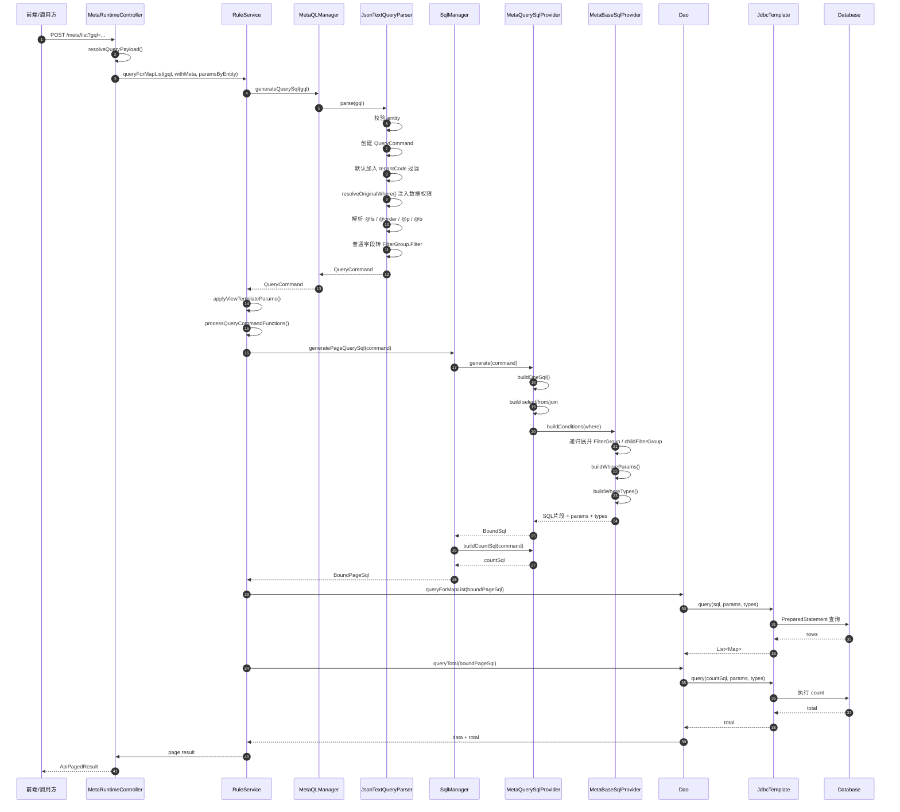
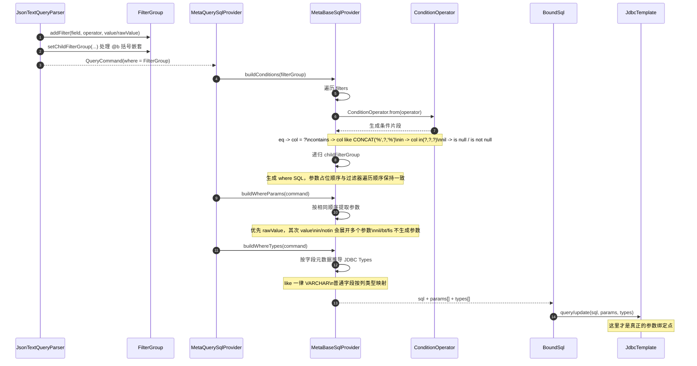
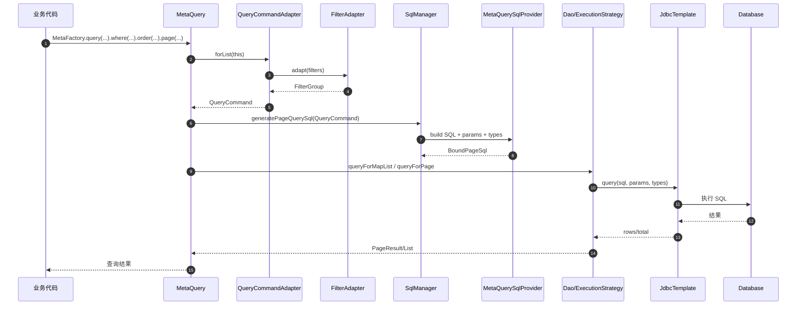

# Geelato MQL 到 SQL 执行时序图

## 目标

本文说明 `geelato-community` 中一条典型 MQL 查询请求，从 Web 入口进入后，如何逐步完成：

- MQL JSON 解析
- `QueryCommand` 构造
- 条件与参数组装
- SQL 文本生成
- JDBC 参数绑定与数据库执行

同时补充 ORM Fluent DSL 与这条链路的复用关系。

## 核心调用链

```text
HTTP /meta/list
-> MetaRuntimeController
-> RuleService
-> MetaQLManager
-> JsonTextQueryParser
-> QueryCommand
-> SqlManager
-> MetaQuerySqlProvider
-> MetaBaseSqlProvider
-> BoundSql / BoundPageSql
-> Dao
-> JdbcTemplate
-> Database
```

## 主查询时序图



## 条件与参数构造时序图



## ORM Fluent DSL 复用链路

ORM Fluent DSL 前半段不是解析 MQL JSON，而是先把 DSL 适配成同一个 `QueryCommand`，后半段继续复用 `SqlManager -> BoundSql -> Dao/JdbcTemplate`。



## 关键阶段说明

### 1. MQL 解析阶段

`JsonTextQueryParser` 负责把 JSON 文本变成 `QueryCommand`：

- 识别实体名
- 解析 `@fs`、`@order`、`@p`、`@b`
- 普通字段解析成 `FilterGroup.Filter`
- 默认增加 `tenantCode`
- 增加 `originalWhere` 数据权限条件

这一阶段还没有直接执行 SQL。

### 2. 条件表达阶段

`FilterGroup` 是 where 条件的中间表达结构：

- `filters` 表示当前层级条件
- `logic` 表示当前层级是 `and` 还是 `or`
- `childFilterGroup` 表示括号嵌套条件

因此复杂条件并不是先拼原始 SQL，而是先表达成树状条件模型。

### 3. SQL 生成阶段

`MetaQuerySqlProvider` 按固定顺序生成 SQL：

1. `select`
2. `from`
3. `join`
4. `where`
5. `and (originalWhere)`
6. `group by`
7. `having`
8. `order by`
9. `limit offset`

分页总数 SQL 则由 `buildCountSql()` 生成。

### 4. 参数绑定阶段

`MetaBaseSqlProvider` 做三件事：

- `buildConditions()` 生成带 `?` 的 where SQL
- `buildWhereParams()` 生成参数数组
- `buildWhereTypes()` 生成 JDBC 类型数组

参数顺序的根本原则是：

- SQL 中 `?` 的出现顺序
- `params[]` 的填充顺序
- `types[]` 的填充顺序

三者保持一致。

### 5. 数据库执行阶段

`Dao` 最终调用 `JdbcTemplate`：

- 查询：`query(...)`
- 单值：`queryForObject(...)`
- 更新：`update(...)`

如果 `BoundSql.types` 非空，则走带类型的 JDBC 参数绑定；否则只传 `params`。

## 参数与条件的几个关键结论

### 大多数普通条件会走参数绑定

例如：

- `eq`
- `neq`
- `gt/gte/lt/lte`
- `contains/startWith/endWith`
- `in/notin`

这类操作会生成 `?` 占位符，并在 `params[]` 中注入对应参数。

### `rawValue` 优先于字符串值

`FilterGroup.Filter` 同时保留：

- `value`：字符串值
- `rawValue`：原始 Java 类型值

组装参数时优先使用 `rawValue`，这样可以减少数值、布尔、日期类型在 JDBC 绑定时被错误当成字符串。

### 并非所有条件都完全参数化

当前实现中，下列内容可能直接写入 SQL 文本：

- `originalWhere` 数据权限 SQL
- 视图模板参数 `@pf`
- `bt`
- `fis`
- 某些 JSON 条件分支

所以这条链路是“以参数化为主”，但不是“全链路全部 PreparedStatement 化”。

## 建议阅读顺序

如果要继续顺着代码深挖，建议按下面顺序看：

1. `MetaRuntimeController`
2. `RuleService`
3. `MetaQLManager`
4. `JsonTextQueryParser`
5. `QueryKeyword`
6. `SqlManager`
7. `MetaQuerySqlProvider`
8. `MetaBaseSqlProvider`
9. `ConditionOperator`
10. `Dao`

## 关键代码位置

- `MetaRuntimeController.list`
  - `geelato-web-platform/src/main/java/cn/geelato/web/platform/srv/meta/MetaRuntimeController.java`
- `RuleService.queryForMapList`
  - `geelato-web-platform/src/main/java/cn/geelato/web/platform/srv/platform/service/RuleService.java`
- `MetaQLManager.generateQuerySql`
  - `geelato-core/src/main/java/cn/geelato/core/mql/MetaQLManager.java`
- `JsonTextQueryParser.parse`
  - `geelato-core/src/main/java/cn/geelato/core/mql/parser/JsonTextQueryParser.java`
- `QueryKeyword`
  - `geelato-core/src/main/java/cn/geelato/core/mql/parser/keyword/QueryKeyword.java`
- `SqlManager.generatePageQuerySql`
  - `geelato-core/src/main/java/cn/geelato/core/sql/SqlManager.java`
- `MetaQuerySqlProvider.buildOneSql`
  - `geelato-core/src/main/java/cn/geelato/core/sql/provider/MetaQuerySqlProvider.java`
- `MetaBaseSqlProvider.buildConditions/buildWhereParams/buildWhereTypes`
  - `geelato-core/src/main/java/cn/geelato/core/sql/provider/MetaBaseSqlProvider.java`
- `ConditionOperator`
  - `geelato-core/src/main/java/cn/geelato/core/sql/provider/ConditionOperator.java`
- `Dao`
  - `geelato-core/src/main/java/cn/geelato/core/orm/Dao.java`

## 总结

从架构上看，这套实现不是“前端 JSON 直接拼 SQL”，而是：

```text
MQL JSON
-> QueryCommand
-> FilterGroup
-> BoundSql
-> JdbcTemplate
-> Database
```

也就是说：

- MQL 先转语义对象
- SQL 再由元数据驱动生成
- 参数在 `BoundSql` 阶段统一收敛
- 最终由 Spring JDBC 完成绑定与执行

这是当前 `geelato-community` 中 MQL 与 ORM Fluent DSL 共用的底层执行主干。
