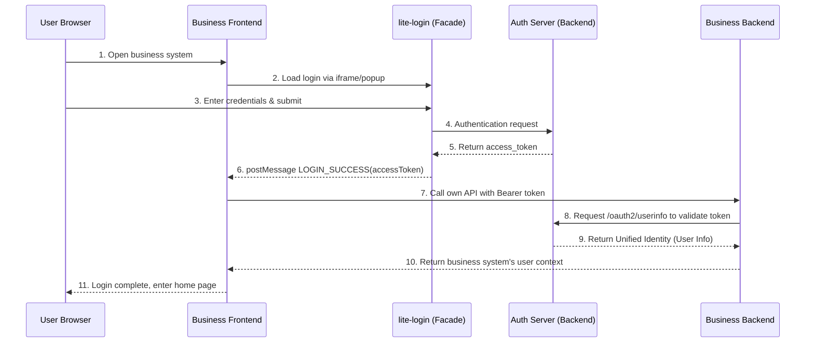

# lite-login Third-Party Integration

This page explains how any third-party application can integrate with the `lite-login` lightweight login facade provided by the unified authentication center.

This guide focuses on two things:

- how the frontend obtains the token issued by `auth-server`
- how the third-party backend uses that token to call OAuth endpoints and confirm user identity

This guide does not assume that the third-party application already has fixed endpoints such as `/api/user/info`, `/session/me`, or `/auth/profile`. Those endpoints are application-specific.

Sample projects:

- Repository: [geelato-hello-example](https://github.com/geelato-projects/geelato-hello-example)
- lite-login integration sample: [sample-lite-login](https://github.com/geelato-projects/geelato-hello-example/tree/main/sample-lite-login)

## Integration Goal

The minimal acceptable result is:

- the third-party frontend can open or embed `lite-login`
- the frontend receives `LOGIN_SUCCESS` after login succeeds
- the frontend can extract and store the token
- the third-party backend can call `/oauth2/userinfo` with a Bearer token
- the third-party backend can build its own local identity mapping from the returned user

## Core Boundary

### Authentication Center

- `auth-server` is the only token issuer
- `lite-login` is the lightweight login facade
- `lite-login` handles login and returns the token
- `auth-server` confirms the identity behind that token through OAuth endpoints

### Third-Party Frontend

- opens or embeds `lite-login`
- listens to `postMessage`
- extracts `accessToken/token`
- stores the token temporarily
- passes the token to its own backend in later requests

### Third-Party Backend

- reads the Bearer token from the request header
- calls `/oauth2/userinfo`
- extracts user identity from the response
- establishes session state, account mapping, or permission context according to its own domain model

## Entry Constraint

Use the explicit lightweight login entry:

```text
https://<auth-host>/lite-login
```

Do not reuse:

```text
/login?display=embedded
```

Each third-party application should keep its own:

```text
/login
```

That page is only the third-party handoff page and should not implement username-password authentication itself.

## Frontend Integration Flow

### Interaction Sequence Diagram

The complete interaction sequence for integrating a business system with lite-login is as follows:



### Standard Sequence Steps

1. The user visits the third-party application's own `/login`
2. The application loads `/lite-login?display=embedded&redirect=...`
3. `lite-login` sends `LOGIN_INIT`
4. The user completes login inside `lite-login`
5. `lite-login` sends `LOGIN_SUCCESS`
6. The frontend extracts the token
7. The frontend stores the token temporarily
8. The frontend includes the token when calling its own backend
9. The backend calls `/oauth2/userinfo`
10. The backend continues business processing with the resolved user identity

### Required Frontend Configuration

At minimum prepare:

- `liteSsoBaseUrl`
  - the base address of the lightweight login facade
  - for example: `http://app.localgl.cn`
- `liteSsoOrigin`
  - the allowed `postMessage` origin
  - for example: `http://app.localgl.cn`

### The Third-Party `/login` Page

Each application should provide its own `/login` page as the handoff page for unified authentication.

Recommended options:

- iframe embedded login
- popup or new-window fallback

The iframe URL should be built as:

```text
/lite-login?display=embedded&redirect=<business-target-url>
```

### `postMessage` Protocol

The frontend should at least handle:

- `LOGIN_INIT`
  - the login page is initialized
- `LOGIN_SUCCESS`
  - login succeeds
  - the token payload exists in `data`
- `LOGIN_CLOSE`
  - the user closes or cancels login

### `LOGIN_SUCCESS` Payload

The frontend should at least be compatible with this structure:

```json
{
  "type": "LOGIN_SUCCESS",
  "data": {
    "accessToken": "xxx",
    "token": "xxx",
    "refreshToken": null,
    "expireInSeconds": 7199,
    "tokenType": "Bearer",
    "issuer": "auth-server",
    "user": {}
  }
}
```

Use this priority when extracting the token:

1. `accessToken`
2. `token`

### Correct Action After Login Success

After receiving `LOGIN_SUCCESS`, the standard frontend actions are only:

1. extract and store the token
2. pass that token to the application's own backend in later requests

Do not hard-code a rule that login success must always be followed by a call to a fixed user-info endpoint, because different third-party applications may not expose the same endpoint shape.

### Frontend Storage Recommendation

At minimum store:

- `geelato_sso_token`
- `geelato_sso_user`
- `geelato_sso_expires`

Whether the application also stores additional local session data is application-specific.

### Request-Layer Handling

The application's shared request layer should automatically read the token and append:

```text
Authorization: Bearer <token>
```

This avoids repeating manual header wiring in every business request.

### Login-State Recovery

A lightweight startup recovery flow can be:

1. read `geelato_sso_token`
2. if the token exists and is not expired, continue using it
3. if the backend later confirms the token is invalid, clear the local token

## Backend Integration Flow

### Minimal Processing Chain

The third-party backend does not need to expose a fixed user-info confirmation endpoint of its own.

The minimal viable approach is:

1. any business endpoint reads `Authorization`
2. extract the Bearer token
3. call `/oauth2/userinfo`
4. extract the user from the response
5. build the application's own identity mapping
6. continue the current business request

### New `/oauth2/userinfo` Contract

The current `/oauth2/userinfo` response is no longer a direct `User`, but a session wrapper:

```json
{
  "code": 200,
  "msg": "ok",
  "data": {
    "accessToken": "...",
    "token": "...",
    "tokenType": "Bearer",
    "issuer": "auth-server",
    "loginId": "demo",
    "user": {
      "...": "..."
    }
  }
}
```

So the backend must:

1. parse `data`
2. then extract `data.user`

Do not parse the entire `data` block directly as a `User`.

### Recommended Compatibility Strategy

Recommended shared helper logic:

1. if `data.user` exists, parse `data.user`
2. otherwise fall back to the older `data -> User` structure

This keeps backward compatibility with historical versions.

### Backend Identity Mapping

After resolving the central-authentication user, the application decides its own follow-up logic, for example:

- use the central user directly as the current user
- map the system account from `loginId`
- bind accounts by email, phone number, or employee number
- create or update a local user mirror
- enrich the user with local tenant, role, or organization context

No unified `LoginResult` response shape is required here.

## Security Requirements

### `postMessage` Origin Validation

The frontend must validate:

```text
event.origin === liteSsoOrigin
```

Never trust arbitrary page origins by default.

### Do Not Trust Frontend `user` Alone

The `user` returned in `LOGIN_SUCCESS` is only auxiliary display information.

The final trusted identity must be confirmed by the backend through the authentication center.

### Token Expiration Handling

When the frontend or backend detects token expiration, it should:

1. clear the local token
2. clear local application session state
3. redirect back to the application's own `/login`

Do not jump directly to the authentication center page.

## Frontend Pseudocode

```ts
const handleSsoMessage = (event: MessageEvent) => {
  if (event.origin !== liteSsoOrigin) return
  if (event.data?.type !== 'LOGIN_SUCCESS') return

  const token = event.data?.data?.accessToken || event.data?.data?.token
  if (!token) return

  localStorage.setItem('geelato_sso_token', token)
  localStorage.setItem('geelato_sso_expires', String(Date.now() + 7200 * 1000))

  navigateTo('/dashboard')
}
```

If the application wants the backend to confirm identity immediately, it may call any of its own backend endpoints right after login success, but that is not a mandatory platform rule.

## Backend Pseudocode

```java
public CurrentUser resolveCurrentUser(HttpServletRequest request) {
    String authorization = request.getHeader("Authorization");
    String accessToken = extractBearerToken(authorization);

    OAuth2ServerResult result = oauth2Service.getUserInfo(authServerUrl, accessToken);
    JSONObject session = JSON.parseObject(result.getData());
    User user = JSON.parseObject(JSON.toJSONString(session.get("user")), User.class);

    return CurrentUser.from(user);
}
```

If old-structure compatibility is required, keep the parsing logic inside a shared helper.

## Integration Checklist

### Frontend Checklist

- does the application have its own `/login`
- does it use `/lite-login` as the real authentication facade
- does it validate `event.origin`
- does it handle `LOGIN_INIT / LOGIN_SUCCESS / LOGIN_CLOSE`
- can it extract `accessToken/token` correctly
- can it attach `Authorization` automatically in later requests
- can it clear local state when the token expires

### Backend Checklist

- can it extract the Bearer token from headers correctly
- does it trust and verify the `auth-server` token
- does it parse the user through `data.user`
- is it compatible with the legacy `userinfo` structure
- has it implemented its own account-mapping logic

## FAQ

### Why does the app return to the login page right after successful login

Check these first:

- whether the request sent to the third-party backend actually includes the Bearer token
- whether `/oauth2/userinfo` is still parsed as the old structure
- whether the unauthenticated frontend fallback mistakenly treats `lite-login` as a normal business page

### Why can't we trust the token and user returned directly to the frontend

Because:

- `lite-login` only handles unified authentication
- the third-party application still decides how that user maps into its own system
- that decision must be made by the third-party backend

### Why keep the application's own `/login`

Because:

- the application needs its own return path
- the application needs its own wording and handoff page
- the authentication center only provides the authentication facade, not the entry experience of each application

## Recommended Landing Pattern

Use this pattern consistently:

- the authentication center provides a unified `lite-login`
- each third-party application keeps its own `/login`
- each third-party frontend follows embedded login, `postMessage`, token storage, and automatic Bearer propagation
- each third-party backend follows Bearer extraction, `/oauth2/userinfo`, `data.user`, and application-specific identity mapping

With this pattern, onboarding a new third-party application only requires changing:

- the application's own `/login` UI
- the application's own user-mapping logic

The rest of the integration skeleton stays reusable.
