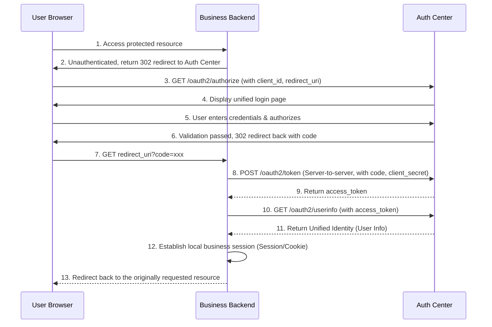

# Standard OAuth2 Business System Integration

For **any application with an independent backend**, or external business systems that have strict security requirements (where tokens must be strictly kept on the server and never exposed to the frontend browser), it is recommended to use the standard **OAuth2 Authorization Code Flow** to integrate with the Unified Authentication Center.

This document introduces the prerequisites, the interaction sequence, and the core steps for obtaining the token and user data.

## 1. Prerequisites: Apply for Credentials

Before starting the integration, the administrator of the external business system must apply for application integration credentials from the Auth Center administrator. You need to obtain and securely store the following information:

- **`client_id`**: The unique identifier of the application.
- **`client_secret`**: The secure key of the application (**MUST NOT** be exposed to the frontend or browser; it must be safely stored in backend code).
- **`redirect_uri`**: The authorized and legal callback URL after a successful login (e.g., `https://your-app.com/login/oauth2/code/geelato`).

## 2. Interaction Sequence

The overall interaction sequence for the standard OAuth2 Authorization Code Flow is as follows:



## 3. Core Integration Steps

### Step 1: Get Authorization Code

When the user is not logged in, the business system redirects the user's browser to the Auth Center's authorization endpoint:

**Method**: `GET`
**URL**: `https://<auth-host>/oauth2/authorize`

**URL Parameters**:
- `response_type`: Must be `code`
- `client_id`: Your assigned `client_id`
- `redirect_uri`: Your assigned valid callback URL
- `state`: (Strongly Recommended) A random string to prevent CSRF attacks, the business system should validate this later.

**Callback Result**:
After successful login at the Auth Center, the center will redirect the browser back to your `redirect_uri`, appending the `code` parameter in the URL:
`https://your-app.com/callback?code=AUTH_CODE_HERE&state=...`

### Step 2: Exchange Code for Token

Upon receiving the `code` from the callback, the business system backend makes a **server-to-server** request to the Auth Center to exchange it for an `access_token`.

**Method**: `POST`
**URL**: `https://<auth-host>/oauth2/token`
**Content-Type**: `application/x-www-form-urlencoded`

**Parameters (Form Data)**:
- `grant_type`: Must be `authorization_code`
- `code`: The authorization code obtained in Step 1
- `client_id`: Your `client_id`
- `client_secret`: Your `client_secret`
- `redirect_uri`: Must be exactly the same as the one used in Step 1

**Success Response Example**:
```json
{
  "access_token": "eyJhbGciOiJIUzI1NiIs...",
  "token_type": "Bearer",
  "expires_in": 7200,
  "refresh_token": "..."
}
```

### Step 3: Get User Data & Establish Local Session

After obtaining the `access_token`, the business system backend needs to call the user info endpoint to retrieve the current user's real identity.

**Method**: `GET`
**URL**: `https://<auth-host>/oauth2/userinfo`
**Headers**:
- `Authorization`: `Bearer <your_access_token>`

**Success Response Example**:
```json
{
  "code": 200,
  "msg": "ok",
  "data": {
    "loginId": "zhangsan",
    "user": {
      "id": "123456789",
      "name": "Zhang San",
      "tenantCode": "geelato"
    }
  }
}
```

> **Crucial Note**:
> The business system must extract the user data from `data.user` in the response. Then, using the identity identifier (such as `loginId` or `user.id`), map it to the user system in the business system's own database. After a successful mapping, establish the business system's own user session (e.g., write to local Session, issue the business system's own Cookie).

## 4. FAQ

- **What if `client_secret` is leaked?**
  You must immediately contact the Auth Center administrator to reset the key, otherwise, malicious third parties could impersonate your app and steal user tokens.

- **What if the Token expires?**
  If a `refresh_token` was provided during authorization, you can seamlessly refresh the token on the backend by calling the `/oauth2/token` endpoint (setting `grant_type` to `refresh_token`). If no refresh token is available or the refresh fails, you must clear the local session and require the user to log in again.

- **Can I call `/oauth2/token` directly from the frontend via AJAX?**
  **Absolutely not.** Calling this endpoint requires the `client_secret`. Placing the secret in the frontend will cause extremely severe security vulnerabilities. This call must occur strictly on the business system's backend.