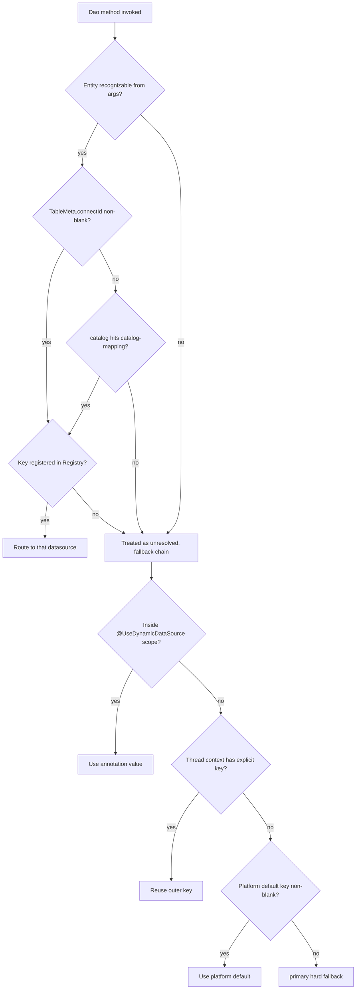

# Entity-to-Datasource Binding

This page answers one question: **which datasource does an entity finally land on**.

In day-to-day use of the dynamic datasource capability, most scenarios need no manual switching — as long as the relationship between an entity and its datasource is declared clearly, the ORM routes automatically at execution time. That declaration is the "entity binding". This page covers all four binding styles, their priorities, and the complete decision chain from an entity to a physical datasource for a single SQL statement.

## Binding Styles at a Glance

| Binding style | Declared in | Typical use | Takes effect |
|---|---|---|---|
| `@Entity(connectId)` | Java entity annotation | The entity inherently belongs to one database, fixed in code | Backfilled at scan time |
| `@Entity(catalog)` + `catalog-mapping` | Entity annotation + YAML/properties | A group of entities belongs to one logical database group | Resolved at query time |
| `platform_dev_table.connect_id` | Registered online via platform designer | Online entities registered at runtime | Merged when registered |
| `addEntityMapping(...)` | `EntityDataSourceResolver` API | In-memory correction or override at runtime | Immediate (lost on restart) |

The first three are adjudicated uniformly by `MetaManager.resolveConnectId`; the fourth writes directly into the resolver cache.

## Style 1: Explicit `@Entity(connectId)`

Declare the datasource directly on the entity class:

```java
@Entity(name = "demo_order", table = "t_demo_order", connectId = "order_db")
public class DemoOrder {
    // ...
}
```

- the value of `connectId` is the dynamic datasource key, i.e. the primary key `id` of the `platform_dev_db_connect` table
- at startup scan time, `MetaReflex.getTableMeta` backfills the annotation value into `TableMeta.connectId` on the entity metadata
- this is the most direct declaration of entity ownership; it wins over catalog mapping within the same slot (see Style 3 below)

Once declared, every ORM query and write against this entity is routed to `order_db` automatically — nothing to do at the call site.

## Style 2: `@Entity(catalog)` Grouping + Configuration Mapping

If a batch of entities belongs to the same database, tagging each with `connectId` is tedious. Tag them with the same `catalog` (a logical group) instead, then map the group to a datasource via configuration:

```java
@Entity(name = "demo_order", catalog = "business")
public class DemoOrder { }

@Entity(name = "demo_order_item", catalog = "business")
public class DemoOrderItem { }
```

```yaml
geelato:
  datasource:
    dynamic:
      catalog-mapping:
        platform: primary
        business: order_db
```

- to switch databases, change configuration only — all entities in the `business` group switch together
- catalog mapping is **not** resolved at scan time; `MetaManager.resolveConnectId` resolves it on demand at query time, so it does not matter when the configuration is injected
- if an entity declares both `connectId` and `catalog`, `connectId` wins (see priority below)

## Style 3: Platform Table Registration via `connect_id`

For entities registered online through the platform designer, datasource ownership is recorded in the platform metadata table:

- `platform_dev_table.connect_id` (database connection id)

Registered values are merged into entity metadata at runtime. There is a **key mechanism you must understand** here:

:::note The annotation value and the registered value share one slot

The `@Entity(connectId)` annotation value and the `platform_dev_table.connect_id` registered value both end up in the same field of the entity metadata: `TableMeta.connectId`. They are **not two priority levels — they are two write paths into the same slot**:

- at startup, the explicit annotation value is backfilled into `TableMeta.connectId` first
- when the platform table is registered at runtime, the DB-sourced `TableMeta` (including the registered `connect_id`) is merged into the existing entity metadata — for non-platform entities, the registered value **overwrites** the previous annotation value
- entities with `catalog = "platform"` are protected: the Java class definition always wins, DB registration never overwrites, and runtime refresh is forbidden

So for ordinary (non-platform) entities: **whichever declaration arrives later owns `TableMeta.connectId`**. In practice, pick a single declaration channel per entity to avoid confusion between annotations and online registration.

:::

This style suits runtime governance scenarios where "the entity goes live first, its ownership is adjusted later", together with the platform table management UI.

## Style 4: Manual Mapping at Runtime

`EntityDataSourceResolver` exposes in-memory mapping APIs:

```java
// add or override the mapping for one entity (target datasource must be registered, otherwise rejected with a warning)
entityDataSourceResolver.addEntityMapping("demo_order", "order_db");

// remove the mapping (next resolution falls back to the metadata chain)
entityDataSourceResolver.removeEntityMapping("demo_order");

// clear the whole mapping cache
entityDataSourceResolver.clearCache();
```

- writes directly into the resolver cache, taking precedence over metadata resolution
- memory-only, **lost on application restart** — suitable for runtime correction, not for permanent declarations
- before adding, it verifies the target key is registered in `DynamicDataSourceRegistry`

## Entity-Level Resolution Priority

The first three styles are adjudicated by `MetaManager.resolveConnectId` with the following rules (high → low):

1. **`TableMeta.connectId` is non-blank** — the annotation value or the platform-table registered value (same slot, see above)
2. **the mapping of `catalog` in `catalog-mapping`** — routes by logical group when no connectId is declared
3. neither → return null and hand over to the fallback chain at Dao-call time (next section)

The resolution result also passes an **existence check**: `EntityDataSourceResolver` confirms the resolved key is actually registered in `DynamicDataSourceRegistry` (an enabled connection in `platform_dev_db_connect`, or another registration channel). If the datasource does not exist, the result is treated as unresolved and the fallback chain continues — it never routes to a nonexistent database.

## The Full Priority Chain at Dao-Call Time

Entity-level resolution only answers "does this entity have an explicit owner". A complete `Dao` call is adjudicated by the `DataSourceInterceptor` aspect, whose full priority (high → low) is:

```text
1. Entity mapping      the entity declares connectId / hits a catalog mapping, and that datasource exists
2. Annotation default  the call is inside a class/method-level @UseDynamicDataSource scope, use value()
3. Outer explicit key   the thread already has a key set by an outer switchDbByConnectId / withDataSource
4. Platform default    the default datasource key written into DataSourceManager at startup
5. primary             the final hard fallback when everything else is absent
```

Details of each level:

**Level 1: entity mapping.** The aspect first resolves the entity name from the `Dao` method arguments (recognition rules in [Switching](switching.md)); if it resolves and yields a valid key, that key is used. This is the path most business calls take.

**Level 2: annotation-scoped default.** When a service class or method carries a class/method-level `@UseDynamicDataSource("xxx")`, the annotation value is written into the thread context as the scoped default before the method runs. Note: a **field-level** `@UseDynamicDataSource` is only an injection marker for `dynamicDao` and produces no scoped default.

**Level 3: outer explicit key.** If outer code set a key in the thread context via `switchDbByConnectId`, the Fluent DSL's `useDataSource(...)`, etc., and no annotation scope is active, that key is reused. This level protects nested switching semantics — an inner operation without an explicit declaration continues on the database the outer scope selected.

**Level 4: platform default key.** Resolved automatically by the ORM at startup and written into `DataSourceManager`: if `geelato.orm.default-data-source-key` is configured, that value is used; otherwise `"primary"` when any of `primaryDataSource` / `primaryJdbcTemplate` / `primaryDao` beans exists.

**Level 5: primary hard fallback.** When all of the above are empty, the constant `"primary"` is used. `primary` is forcibly registered by the routing datasource and can never be null, so this chain **always resolves to a concrete datasource key** and never ends with null.

## The Complete Decision Flow of One SQL Statement



## Common Misconceptions

**Misconception 1: the annotation value and the DB registered value are two priority levels.**

They are not. Both write into the same slot `TableMeta.connectId`; runtime registration (for non-platform entities) overwrites the backfilled annotation value. Priority exists only between "the `connectId` slot" and "catalog mapping".

**Misconception 2: an unconfigured catalog mapping means it never works.**

Catalog mapping is resolved on demand at query time; configuring it after startup takes effect immediately, regardless of entity scan order.

**Misconception 3: a bound connectId always routes.**

Two preconditions also apply: the execution entry must be `dynamicDao`, the only Dao that consumes routing keys (`primaryDao` connects straight to the physical primary and never routes — see [Switching](switching.md)); and the key must correspond to an existing, enabled datasource, otherwise it is treated as unresolved and the fallback chain applies.

**Misconception 4: platform entities can be registered to another database.**

Entities with `catalog = "platform"` are protected: the Java class definition wins, runtime refresh and DB override are forbidden. Mapping `platform` to `primary` in `catalog-mapping` is recommended to stay consistent with the system database.

## Suggested Reading

- [Dynamic Datasource Overview](overview.md) — overall chain and core beans
- [Configuration](configuration.md) — connection table, YAML properties and the default datasource
- [Switching](switching.md) — automatic switching rules, manual APIs and transaction limits
