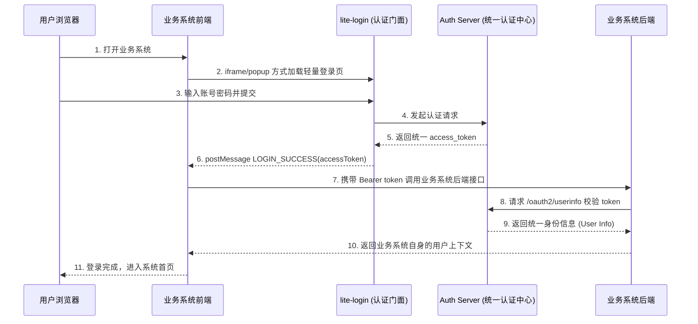

# lite-login 第三方应用接入

这一页说明任意第三方应用如何接入统一认证中心的 `lite-login` 轻量登录门面。

本文档聚焦两件事：

- 前端如何拿到 `auth-server` 签发的 token
- 第三方应用后端如何使用这个 token 调用 OAuth 接口确认用户身份

本文档不预设第三方应用一定存在固定的 `/api/user/info`、`/session/me` 或 `/auth/profile` 接口；这些接口是否存在、叫什么名字，由第三方应用自己决定。

对应示例工程：

- 仓库：[geelato-hello-example](https://github.com/geelato-projects/geelato-hello-example)
- lite-login 接入示例：[sample-lite-login](https://github.com/geelato-projects/geelato-hello-example/tree/main/sample-lite-login)

## 接入目标

接入后的最小结果应满足：

- 第三方应用前端能够拉起或嵌入 `lite-login`
- 登录成功后前端能够收到 `LOGIN_SUCCESS`
- 前端能够提取并保存 token
- 第三方应用后端能够用 Bearer token 调用认证中心 `/oauth2/userinfo`
- 第三方应用后端能够基于认证中心返回用户建立本地身份映射

## 核心边界

### 认证中心职责

- `auth-server` 是唯一 token 签发方
- `lite-login` 是轻量登录门面
- `lite-login` 负责用户登录并回传 token
- `auth-server` 负责通过 OAuth 接口确认 token 对应身份

### 第三方应用前端职责

- 打开或嵌入 `lite-login`
- 监听 `postMessage`
- 提取 `accessToken/token`
- 暂存 token
- 在后续请求中把 token 传给自己后端

### 第三方应用后端职责

- 从请求头中读取 Bearer token
- 调用认证中心 `/oauth2/userinfo`
- 从返回结果中提取用户身份
- 按自己系统的业务模型建立会话、账号映射或权限上下文

## 入口约束

统一使用明确的轻量登录入口：

```text
https://<auth-host>/lite-login
```

不要再复用：

```text
/login?display=embedded
```

推荐每个第三方应用保留自己的：

```text
/login
```

但这个 `/login` 只作为第三方应用自己的承接页，不自己实现用户名密码认证。

## 前端接入流程

### 交互时序图

业务系统接入 lite-login 的完整交互时序如下：



### 标准时序步骤

1. 用户访问业务系统自己的 `/login`
2. 第三方应用加载统一登录页 `/lite-login?display=embedded&redirect=...`
3. `lite-login` 初始化后发送 `LOGIN_INIT`
4. 用户在 `lite-login` 中完成登录
5. `lite-login` 登录成功后发送 `LOGIN_SUCCESS`
6. 第三方应用前端提取 token
7. 第三方应用前端将 token 暂存
8. 第三方应用前端在调用自己后端接口时携带该 token
9. 第三方应用后端用 token 调认证中心 `/oauth2/userinfo`
10. 第三方应用后端根据返回的用户身份继续自己的业务处理

### 前端必须准备的配置

至少需要这些配置：

- `liteSsoBaseUrl`
  - 统一登录门面宿主地址
  - 例如：`http://app.localgl.cn`
- `liteSsoOrigin`
  - `postMessage` 来源校验地址
  - 例如：`http://app.localgl.cn`

### 第三方应用自己的 `/login`

每个第三方应用建议提供自己的 `/login` 页面，用于承接统一登录。

推荐至少支持两种方式：

- iframe 嵌入登录
- 新窗口登录兜底

iframe 地址统一构造为：

```text
/lite-login?display=embedded&redirect=<业务目标地址>
```

### `postMessage` 协议

前端至少需要处理这些消息：

- `LOGIN_INIT`
  - 登录页初始化完成
- `LOGIN_SUCCESS`
  - 登录成功
  - `data` 中携带 token 结果
- `LOGIN_CLOSE`
  - 用户主动关闭或取消登录

### `LOGIN_SUCCESS` 数据契约

前端至少应兼容以下结构：

```json
{
  "type": "LOGIN_SUCCESS",
  "data": {
    "accessToken": "xxx",
    "token": "xxx",
    "refreshToken": null,
    "expireInSeconds": 7199,
    "tokenType": "Bearer",
    "issuer": "auth-server",
    "user": {}
  }
}
```

取 token 时统一按以下优先级：

1. `accessToken`
2. `token`

### 登录成功后的正确处理

前端拿到 `LOGIN_SUCCESS` 后，标准动作只有两步：

1. 提取并保存 token
2. 在后续请求中把 token 传给第三方应用自己的后端

不要把“登录成功后必须先调用某个固定用户信息接口”写死成统一规范，因为第三方应用未必存在该接口。

### 前端存储建议

建议至少存储：

- `geelato_sso_token`
- `geelato_sso_user`
- `geelato_sso_expires`

第三方应用自己是否另外保存本地会话信息，由应用自行决定。

### 前端请求层处理

第三方应用的公共请求层应自动从本地读取 token，并在存在 token 时自动追加：

```text
Authorization: Bearer <token>
```

这样不需要每个业务请求手工拼接认证头。

### 前端登录态恢复

应用启动时可做轻量恢复：

1. 读取 `geelato_sso_token`
2. 如果 token 存在且未过期，则继续用于后续请求
3. 若后端后续判定 token 无效，再清理本地 token

## 后端接入流程

### 最小处理链路

第三方应用后端不强制要求存在固定的“用户信息确认接口”。

最小可用方式是：

1. 任意业务接口从请求头读取 `Authorization`
2. 提取 Bearer token
3. 调用认证中心 `/oauth2/userinfo`
4. 从返回结果中提取用户
5. 建立第三方应用自己的身份映射
6. 继续处理本次业务请求

### `/oauth2/userinfo` 新契约

当前认证中心 `/oauth2/userinfo` 返回的不是 `User` 直出，而是 session 包装结构：

```json
{
  "code": 200,
  "msg": "ok",
  "data": {
    "accessToken": "...",
    "token": "...",
    "tokenType": "Bearer",
    "issuer": "auth-server",
    "loginId": "demo",
    "user": {
      "...": "..."
    }
  }
}
```

因此第三方应用后端必须：

1. 先解析 `data`
2. 再提取 `data.user`

不要直接把整个 `data` 当成 `User` 解析。

### 推荐后端兼容策略

推荐公共 helper 使用如下逻辑：

1. 如果 `data` 中存在 `user` 字段，则解析 `data.user`
2. 如果不存在 `user` 字段，则回退兼容老结构的 `data -> User`

这样可以兼容历史版本。

### 后端身份映射

第三方应用后端拿到认证中心用户后，后续处理由第三方自己决定，常见方式包括：

- 直接把认证中心用户当作当前用户
- 根据认证中心 `loginId` 映射本系统账户
- 根据邮箱、手机号、工号做账号绑定
- 在本系统创建或更新本地用户镜像
- 基于本地租户、角色、组织做二次补充

这里不强制要求统一的 `LoginResult` 返回结构。

## 安全要求

### `postMessage` 来源校验

前端必须校验：

```text
event.origin === liteSsoOrigin
```

不要默认信任任意页面来源。

### 不要只信前端 `user`

前端从 `LOGIN_SUCCESS` 拿到的 `user` 只能作为辅助显示信息。

最终可信身份必须以后端调用认证中心确认结果为准。

### token 失效处理

当前端或后端发现 token 已失效时，应：

1. 清理本地 token
2. 清理本地应用会话
3. 跳回第三方应用自己的 `/login`

而不是直接跳到认证中心页面。

## 前端参考伪代码

```ts
const handleSsoMessage = (event: MessageEvent) => {
  if (event.origin !== liteSsoOrigin) return
  if (event.data?.type !== 'LOGIN_SUCCESS') return

  const token = event.data?.data?.accessToken || event.data?.data?.token
  if (!token) return

  localStorage.setItem('geelato_sso_token', token)
  localStorage.setItem('geelato_sso_expires', String(Date.now() + 7200 * 1000))

  navigateTo('/dashboard')
}
```

如果第三方应用希望立即让后端确认身份，也可以在登录成功后立刻请求自己的任意后端接口，但这不是统一强制要求。

## 后端参考伪代码

```java
public CurrentUser resolveCurrentUser(HttpServletRequest request) {
    String authorization = request.getHeader("Authorization");
    String accessToken = extractBearerToken(authorization);

    OAuth2ServerResult result = oauth2Service.getUserInfo(authServerUrl, accessToken);
    JSONObject session = JSON.parseObject(result.getData());
    User user = JSON.parseObject(JSON.toJSONString(session.get("user")), User.class);

    return CurrentUser.from(user);
}
```

如果需要兼容旧结构，建议把解析动作收敛到公共 helper。

## 接入检查清单

### 前端检查

- 是否存在第三方应用自己的 `/login`
- 是否使用 `/lite-login` 作为真实认证门面
- 是否校验了 `event.origin`
- 是否处理了 `LOGIN_INIT / LOGIN_SUCCESS / LOGIN_CLOSE`
- 是否能正确提取 `accessToken/token`
- 是否能在后续请求中自动带上 `Authorization`
- 是否能在 token 失效后清理本地状态

### 后端检查

- 是否能从请求头正确提取 Bearer token
- 是否信任并确认 `auth-server` token
- 是否按 `data.user` 解析认证中心用户
- 是否兼容旧版 `userinfo` 返回结构
- 是否已建立本应用自己的用户映射逻辑

## 常见问题

### 登录成功后又回到登录页

优先检查：

- 传给第三方应用后端的请求是否带了 Bearer token
- `/oauth2/userinfo` 是否仍按旧结构解析
- 前端未授权兜底是否误把 `lite-login` 当成普通业务页

### 为什么不能只信前端拿到的 token 和 user

因为：

- `lite-login` 只负责统一认证
- 第三方应用还需要决定如何把这个用户落到自己的系统里
- 这件事必须由第三方后端完成

### 为什么还要保留第三方应用自己的 `/login`

因为：

- 第三方应用需要自己的回跳地址
- 第三方应用需要自己的文案和承接页
- 统一认证中心只负责认证门面，不负责组织第三方应用入口体验

## 推荐落地方式

建议统一按以下方式组织：

- 认证中心提供统一的 `lite-login`
- 每个第三方应用保留自己的 `/login`
- 每个第三方应用前端统一走：嵌入登录页、`postMessage`、token 暂存、请求时自动带 Bearer token
- 每个第三方应用后端统一走：Bearer token、`/oauth2/userinfo`、`data.user`、本应用自己的身份映射

这样后续新增任意第三方应用时，只需替换：

- 第三方应用自己的 `/login` UI
- 第三方应用自己的用户映射逻辑

其余接入骨架都可以保持一致。
