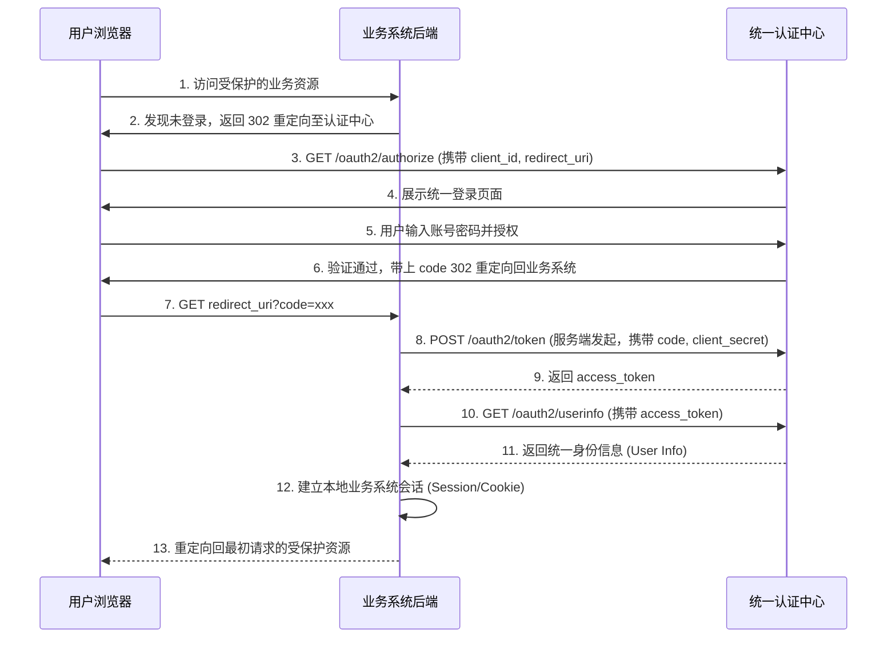

# 标准 OAuth2 业务系统接入

对于**拥有独立后端的任意应用**，或者强安全要求（希望将 Token 严格保存在服务端、不暴露给前端浏览器）的外部业务系统，推荐使用标准的 **OAuth2 授权码模式（Authorization Code Flow）** 接入统一认证中心。

本文档介绍接入的前提条件、交互时序，以及获取 Token 与用户数据的核心步骤。

## 接入前提：申请应用凭证

集成前，外部业务系统管理员需向统一认证中心管理员申请应用接入凭证，并妥善保管以下信息：

- **`client_id`**：应用的唯一标识。
- **`client_secret`**：应用的安全秘钥（**不可**暴露给前端或浏览器，必须在后端代码中安全存放）。
- **`redirect_uri`**：授权成功后的合法安全回调地址（例如 `https://your-app.com/login/oauth2/code/geelato`）。

## 交互时序图

标准 OAuth2 授权码模式的整体交互时序如下：



## 核心集成步骤

### 第一步：获取授权码 (Authorization Code)

当用户未登录时，业务系统将用户浏览器重定向到认证中心的授权端点：

**请求方式**：`GET`
**请求地址**：`https://<auth-host>/oauth2/authorize`

**URL 请求参数**：
- `response_type`：固定填 `code`
- `client_id`：申请获得的 `client_id`
- `redirect_uri`：申请获得的合法回调地址
- `state`：防止 CSRF 攻击的随机字符串，业务系统需自行验证该字段

**回调结果**：
用户在认证中心登录成功后，认证中心会将浏览器重定向回 `redirect_uri`，并在 URL 中附带 `code` 参数：
`https://your-app.com/callback?code=AUTH_CODE_HERE&state=...`

### 第二步：使用授权码换取 Token

业务系统后端在收到回调的 `code` 后，**在服务端侧**向认证中心发起请求，换取 `access_token`。

**请求方式**：`POST`
**请求地址**：`https://<auth-host>/oauth2/token`
**Content-Type**：`application/x-www-form-urlencoded`

**请求参数（Form 表单数据）**：
- `grant_type`：固定填 `authorization_code`
- `code`：上一步获取到的授权码
- `client_id`：申请获得的 `client_id`
- `client_secret`：申请获得的 `client_secret`
- `redirect_uri`：必须与上一步保持完全一致

**成功响应示例**：
```json
{
  "access_token": "eyJhbGciOiJIUzI1NiIs...",
  "token_type": "Bearer",
  "expires_in": 7200,
  "refresh_token": "..."
}
```

### 第三步：获取用户数据并建立本地会话

拿到 `access_token` 后，业务系统后端需调用用户信息接口获取当前登录用户的真实身份。

**请求方式**：`GET`
**请求地址**：`https://<auth-host>/oauth2/userinfo`
**请求头**：
- `Authorization`: `Bearer <access_token>`

**成功响应示例**：
```json
{
  "code": 200,
  "msg": "ok",
  "data": {
    "loginId": "zhangsan",
    "user": {
      "id": "123456789",
      "name": "张三",
      "tenantCode": "geelato"
    }
  }
}
```

> **重要**：
> 业务系统必须从返回结果的 `data.user` 中提取用户数据，再根据身份标识（如 `loginId` 或 `user.id`）与业务系统自身数据库的用户体系进行映射。映射成功后，建立业务系统自己的用户会话（如写入本地 Session、下发业务系统自己的 Cookie 等）。

## 常见问题

- **`client_secret` 不慎泄露了怎么办？**
  必须立即联系统一认证中心管理员重置秘钥，否则恶意第三方可能伪造应用骗取用户 Token。

- **Token 过期了怎么办？**
  如果授权时下发了 `refresh_token`，可通过调用 `/oauth2/token`（将 `grant_type` 设为 `refresh_token`）接口在服务端刷新；如果未提供刷新 Token 或刷新失败，则需清理本地会话并要求用户重新登录。

- **可以直接在前端 AJAX 调用 `/oauth2/token` 吗？**
  **绝对不行**。因为调用该接口需要携带 `client_secret`，将其放在前端会导致极其严重的安全漏洞。此调用必须在业务系统后端发生。