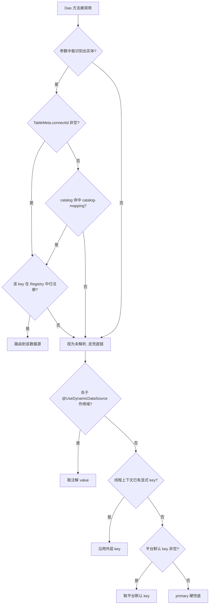

# 实体与数据源绑定

本页专门回答一个问题：**一个实体最终落在哪个数据源上**。

动态数据源的日常使用中，绝大多数场景不需要手工切库——你只要把实体和数据源的关系声明清楚，ORM 执行时就会自动路由。这个声明就是"实体绑定"。本页说明全部四种绑定方式、它们的优先级，以及一条 SQL 从实体到物理数据源的完整决策链。

先给出结论总览，再逐项展开。

## 绑定方式总览

| 绑定方式 | 声明位置 | 适用场景 | 生效时机 |
|---|---|---|---|
| `@Entity(connectId)` | Java 实体类注解 | 实体天然属于某个库，代码里写死 | 启动扫描期回填 |
| `@Entity(catalog)` + `catalog-mapping` | 实体注解 + YAML/properties 配置 | 一批实体按逻辑分组归属同一个库 | 查询期即时解析 |
| `platform_dev_table.connect_id` | 平台设计器在线登记 | 运行期动态登记的在线实体 | 运行期登记时合并 |
| `addEntityMapping(...)` | `EntityDataSourceResolver` API | 运行期内存级修正或覆盖 | 调用即生效（重启失效） |

四种方式互相独立，前三种由 `MetaManager.resolveConnectId` 统一裁决，第四种直接写入解析器缓存。

## 方式一：`@Entity(connectId)` 显式声明

在实体类上直接声明它走哪个数据源：

```java
@Entity(name = "demo_order", table = "t_demo_order", connectId = "order_db")
public class DemoOrder {
    // ...
}
```

- `connectId` 的值就是动态数据源的 key，对应 `platform_dev_db_connect` 表的主键 `id`
- 启动扫描期由 `MetaReflex.getTableMeta` 把注解值回填到实体元数据的 `TableMeta.connectId` 字段
- 这是实体归属最直接的声明，在同槽位（见下文"方式三"）且 catalog 映射之前裁决

声明后，对该实体的所有 ORM 查询与写入都会自动路由到 `order_db`，无需在调用处做任何事。

## 方式二：`@Entity(catalog)` 分组 + 配置映射

如果一批实体同属一个库，逐个标 `connectId` 较繁琐。可以给它们标同一个 `catalog`（逻辑分组），再通过配置把分组映射到数据源：

```java
@Entity(name = "demo_order", catalog = "business")
public class DemoOrder { }

@Entity(name = "demo_order_item", catalog = "business")
public class DemoOrderItem { }
```

```yaml
geelato:
  datasource:
    dynamic:
      catalog-mapping:
        platform: primary
        business: order_db
```

- 换库时只改配置、不改代码，`business` 分组下的所有实体一起切换
- catalog 映射**不在启动扫描期解析**，而是查询期由 `MetaManager.resolveConnectId` 即时解析——因此配置何时注入都不影响结果
- 同一实体若同时声明了 `connectId` 和 `catalog`，`connectId` 胜出（见下文优先级）

## 方式三：平台表登记 `connect_id`

通过平台设计器在线登记的实体，其数据源归属记录在平台元数据表：

- `platform_dev_table.connect_id`（数据库连接 id）

登记值在运行期合并进实体元数据。这里有一个**必须理解的关键机制**：

:::note 注解值与登记值是同一个槽位

`@Entity(connectId)` 注解值和 `platform_dev_table.connect_id` 登记值，最终都写入实体元数据的同一个字段 `TableMeta.connectId`。它们**不是两级优先级，而是同一槽位的两条写入路径**：

- 启动时，注解显式值先回填到 `TableMeta.connectId`
- 运行期平台表登记时，DB 源的 `TableMeta`（含登记的 `connect_id`）整体合并进已有实体元数据——对非 platform 实体，登记值会**覆盖**此前的注解值
- `catalog = "platform"` 的系统内置实体受保护：Java 类定义始终优先，DB 登记不覆盖，也禁止运行期刷新

因此对于普通（非 platform）实体：**谁的声明后到，`TableMeta.connectId` 就是谁的值**。实践中建议一个实体的归属只选一种声明途径，避免注解与在线登记不一致带来的困惑。

:::

这种方式适合"实体先上线、归属后调整"的运行期治理场景，配合平台的表管理界面使用。

## 方式四：运行期手工映射

`EntityDataSourceResolver` 提供了内存级的映射操作 API：

```java
// 添加或覆盖一个实体的数据源映射（目标数据源必须已注册，否则拒绝并告警）
entityDataSourceResolver.addEntityMapping("demo_order", "order_db");

// 移除映射（下次解析回退到元数据链路）
entityDataSourceResolver.removeEntityMapping("demo_order");

// 清空全部映射缓存
entityDataSourceResolver.clearCache();
```

- 直接写入解析器缓存，优先于元数据解析结果
- 仅存在于内存，**应用重启后失效**，适合运行期修正，不适合作为常驻声明
- 添加前会校验目标数据源 key 已在 `DynamicDataSourceRegistry` 中注册

## 实体级解析优先级

前三种方式由 `MetaManager.resolveConnectId` 统一裁决，规则如下（高 → 低）：

1. **`TableMeta.connectId` 非空** —— 即注解显式值或平台表登记值（同一槽位，见上文说明）
2. **`catalog` 在 `catalog-mapping` 中的映射值** —— 实体未声明 connectId 时按逻辑分组路由
3. 都没有 → 返回 null，交由 Dao 调用期的兜底链决定（见下节）

解析结果还要通过一道**存在性校验**：`EntityDataSourceResolver` 会确认解析出的 key 在 `DynamicDataSourceRegistry` 中真实注册（对应 `platform_dev_db_connect` 中启用状态的连接，或其他注册途径）。如果数据源不存在，视为未解析，继续走兜底链——不会路由到一个不存在的库上。

## Dao 调用期的完整优先级链

实体级解析只回答"这个实体有没有明确归属"。一次完整的 `Dao` 调用由 `DataSourceInterceptor` 切面裁决最终数据源 key，完整优先级（高 → 低）：

```text
1. 实体映射        实体声明了 connectId / 命中 catalog 映射，且该数据源真实存在
2. 注解作用域默认  当前调用处于类/方法级 @UseDynamicDataSource 作用域内，取注解 value()
3. 外层已显式 key  当前线程已被外层 switchDbByConnectId / withDataSource 等设置过 key
4. 平台默认 key    启动时写入 DataSourceManager 的默认数据源 key
5. primary        所有兜底均失效时的最终硬兜底
```

各级的细节：

**第 1 级：实体映射。** 切面先从 `Dao` 方法参数中识别实体名（识别规则见[切换方式](switching.md)），能识别到且实体解析出有效 key，直接采用。这是绝大多数业务调用命中的路径。

**第 2 级：注解作用域默认。** 服务类或方法上标注了类/方法级 `@UseDynamicDataSource("xxx")` 时，进入方法前注解值被写入线程上下文作为"作用域默认源"。注意：**字段级** `@UseDynamicDataSource` 仅作为 `dynamicDao` 的注入标记，不产生作用域默认值。

**第 3 级：外层已显式设置的 key。** 外层代码通过 `switchDbByConnectId`、Fluent DSL 的 `useDataSource(...)` 等方式在线程上下文设置了 key，且当前不在注解作用域内，则沿用该 key。这一级保护嵌套切库语义——外层切好的库，内层未明确声明的操作继续沿用。

**第 4 级：平台默认 key。** 启动时由 ORM 自动解析并写入 `DataSourceManager`，规则：配置了 `geelato.orm.default-data-source-key` 则取配置值；否则容器中存在 `primaryDataSource` / `primaryJdbcTemplate` / `primaryDao` 任一 bean 时取 `"primary"`。

**第 5 级：primary 硬兜底。** 以上全部为空时，回落到常量 `"primary"`。`primary` 由路由数据源强制注册且不可为空，因此这条链**永远解析出一个确定的数据源 key**，不会以 null 结束。

## 一条 SQL 的完整决策流程



## 常见误区

**误区一：注解值和 DB 登记值是两级优先级。**

不是。两者写入同一个槽位 `TableMeta.connectId`，运行期登记（非 platform 实体）会覆盖注解回填值。优先级只存在于"`connectId` 槽位"与"catalog 映射"之间。

**误区二：catalog 映射没配就是没生效。**

catalog 映射在查询期即时解析，框架启动后再补配置同样生效，与实体扫描的先后顺序无关。

**误区三：实体绑定了 connectId 就一定会切过去。**

还依赖两个前提：一是执行入口必须是能消费路由 key 的 `dynamicDao`（`primaryDao` 直连物理主库，恒不路由，见[切换方式](switching.md)）；二是该 key 对应的数据源真实存在且已启用，否则按未解析处理走兜底链。

**误区四：把 platform 实体登记到其他库。**

`catalog = "platform"` 的系统内置实体受保护：以 Java 类定义为准，禁止运行期刷新和 DB 覆盖。建议在 `catalog-mapping` 中把 `platform` 映射到 `primary`，保持与系统库一致。

## 推荐继续阅读

- [动态数据源总览](overview.md) —— 模块整体链路与核心 Bean
- [配置方式](configuration.md) —— 连接表、YAML 参数与默认数据源的完整配置说明
- [切换方式](switching.md) —— 自动切库的识别规则、手工切换 API 与事务限制
